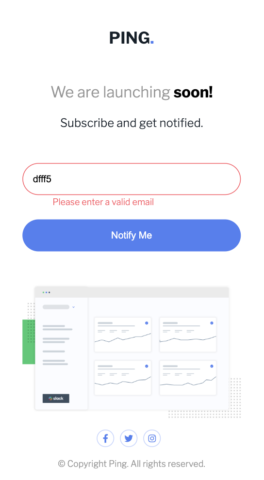
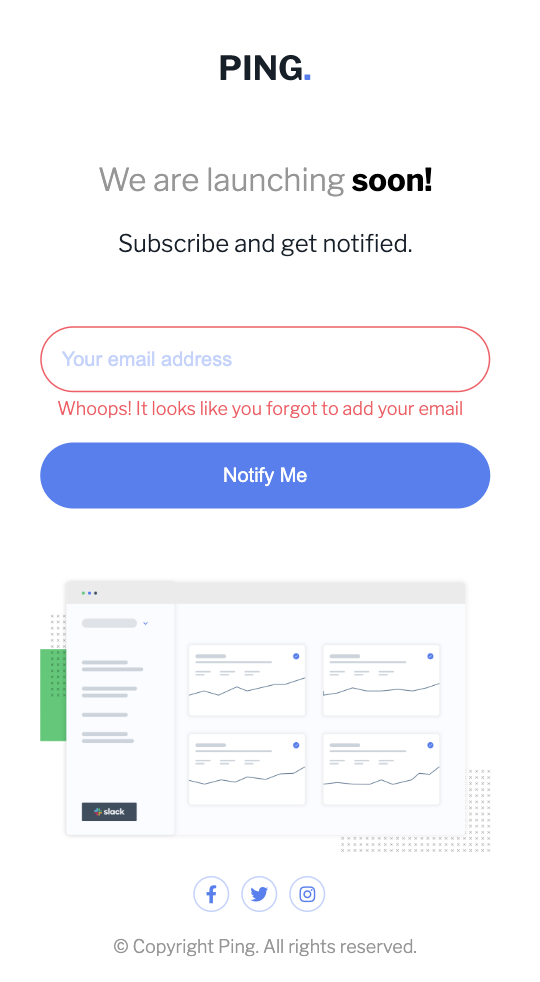

# Frontend Mentor - Ping coming soon page solution

This is a solution to the [Ping coming soon page challenge on Frontend Mentor](https://www.frontendmentor.io/challenges/ping-single-column-coming-soon-page-5cadd051fec04111f7b848da). Frontend Mentor challenges help you improve your coding skills by building realistic projects. 

## Table of contents

- [Overview](#overview)
  - [The challenge](#the-challenge)
  - [Screenshot](#screenshot)
  - [Links](#links)
- [My process](#my-process)
  - [Built with](#built-with)
  - [What I learned](#what-i-learned)
  - [Useful resources](#useful-resources)
- [Author](#author)

**Note: Delete this note and update the table of contents based on what sections you keep.**

## Overview

### The challenge

Users should be able to:

- View the optimal layout for the site depending on their device's screen size
- See hover states for all interactive elements on the page
- Submit their email address using an `input` field
- Receive an error message when the `form` is submitted if:
	- The `input` field is empty. The message for this error should say *"Whoops! It looks like you forgot to add your email"*
	- The email address is not formatted correctly (i.e. a correct email address should have this structure: `name@host.tld`). The message for this error should say *"Please provide a valid email address"*

### Screenshot






### Links

- Solution URL: [Github Solution Repository](https://github.com/MarioLisbona/FEM-ping-coming-soon)
- Live Site URL: [Github Live Site](https://mariolisbona.github.io/FEM-ping-coming-soon/)

## My process

I created the main container and used flexbox to align all the sibling div's for the title, form, error message container and the social links at the bottom of the page.

I used flexbox on the form to arrange the email input and submit button.

A hidden class is used with ```display: none``` to hide the error message. iv used ```classList.remove``` and ```classList.add``` to add and remove the hidden class when the email entered is valid or invalid.

i created a function ```checkEmail(email, emailRegex)``` which takes in two arguments. the email element and a regular expression to check the email is valid. This is used to style the input for a correct email and also give different error messages for an invalid email and an empty email field.

Iv used the following to call the checkEmail function everytime a key is entered into the input field, so essentially giving instant feedback while data is being entered into the input field:

```
email.oninput = () => {
    checkEmail(email, emailRegex);
}
```

I used Font Awesome for the social icons. I wrapped them in an <a> tag to link to their websites.
Font Awsome have a class ```fa-swap-opacity``` that you can add to swap the opacity. I wanted to add and remove this class with javaScript and a pseudoclass of :hover for changing the hover state of the social links. I tried and it didnt work. Upon further reading i realised that you need a pro subscription for this feature to work.

### Built with

- Semantic HTML5 markup
- CSS custom properties
- Flexbox
- CSS Grid
- JavaScript

**Note: These are just examples. Delete this note and replace the list above with your own choices**

### What I learned

i learned to used Font Awesome's icons and change the styling of different icons rather than downloading an image.


### Useful resources

- [Swapping Icon Opacity](https://fontawesome.com/v6/docs/web/style/duotone) - This was a good resource to learn about the styling of icons - even though i couldnt swap the opcaity with a free account.
- [Styling Placeholder Text](https://www.w3schools.com/howto/howto_css_placeholder.asp) - This resource explained how to style the placeholder text

## Author

- Frontend Mentor - [@MarioLisbona](https://www.frontendmentor.io/profile/MarioLisbona)
- Twitter - [@MarioLisbona](https://www.twitter.com/Mariolisbona)
